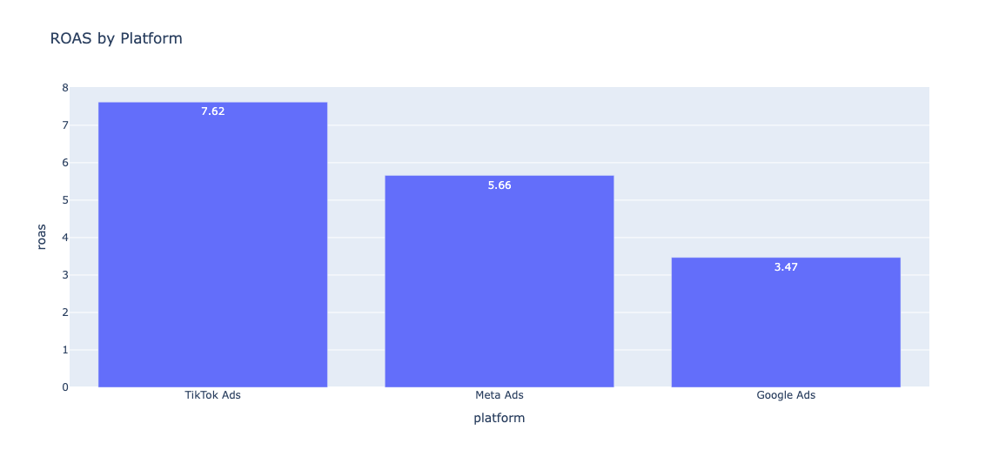
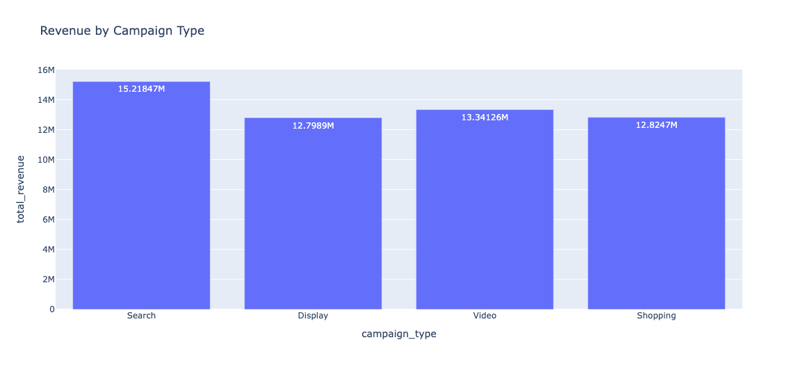
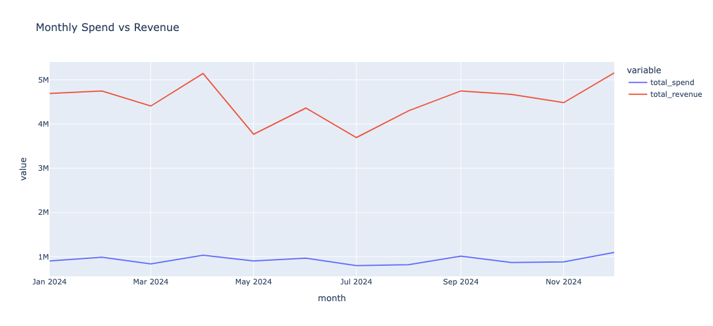
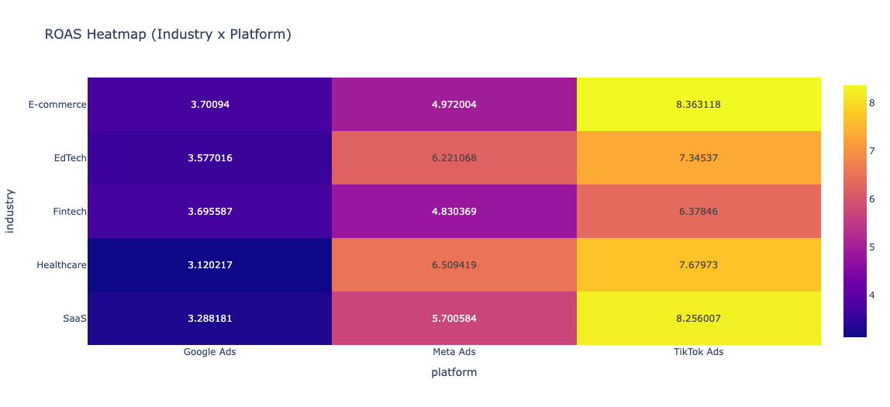

# Ad Product Feature Adoption Analytics Dashboard

## Overview
This project simulates a **product analytics + BI workflow** for tracking ad product feature adoption and performance across advertiser segments. It uses **Python, SQL (BigQuery-style modeling), and Streamlit** to build an end-to-end pipeline from raw campaign data → analytics marts → dashboard.

The goal is to replicate how a **Go-to-Market Product Data Warehouse team** enables sales and product leadership with KPI-driven insights and actionable recommendations.

---

## Tech Stack
- Python  
- SQL (BigQuery-style data modeling)  
- Streamlit  
- ETL Pipelines  

---

## Dataset
Campaign-level advertising data across:
- Google Ads  
- Meta Ads  
- TikTok Ads  

Core fields:
`date, platform, campaign_type, industry, impressions, clicks, ad_spend, conversions, revenue`

---

## Data Modeling (BigQuery-style)
Structured into:

- **Raw Layer:** `raw.global_ads_performance`  
- **Cleaned Layer:** standardized campaign activity  
- **Fact Table:** campaign-level metrics + derived features  
- **Dimensions:** advertiser segment, date, feature signals  
- **Marts:** feature adoption, segment performance, trends, sales opportunities  

---

## KPIs Defined
- CTR = clicks / impressions  
- Conversion Rate = conversions / clicks  
- ROAS = revenue / spend  
- Feature Adoption Rate (derived signals)  
- Revenue & Efficiency by segment  

---

## Key Results

### Platform Performance

| Platform     | Revenue | Spend  | ROAS |
|--------------|--------|--------|------|
| TikTok Ads   | $20.2M | $2.65M | **7.62** |
| Meta Ads     | $11.9M | $2.10M | **5.66** |
| Google Ads   | $22.0M | $6.35M | **3.47** |

---

## Insights

- **TikTok Ads has the highest efficiency (ROAS 7.62)** → strongest return per dollar spent  
- **Google Ads drives highest scale** but lowest efficiency → diminishing returns  
- **Meta Ads provides balanced performance** between scale and efficiency  
- **Search campaigns dominate revenue**, while **Video campaigns show strong efficiency potential**  
- Platform–industry differences highlight **targeted optimization opportunities**
---
## Visual Results

### ROAS by Platform


### Revenue by Campaign Type


### Monthly Spend vs Revenue


### ROAS Heatmap (Industry × Platform)


## Business Recommendations

- Reallocate budget toward **high-ROAS platforms (TikTok Ads)**  
- Optimize **Google Ads campaigns** (targeting, bidding, structure)  
- Use **segment-level insights (industry × platform)** for sales prioritization  
- Focus on **high-spend, low-efficiency segments** for optimization  

---

## Dashboard Features

- Feature adoption tracking (simulated signals)  
- Platform & campaign performance breakdown  
- Monthly spend vs revenue trends  
- Industry × platform heatmap  
- Sales opportunity identification  

---

## How to Run

### 1. Clone the repository
```bash
git clone <repo-link>
cd ad-product-feature-adoption-dashboard
```

### 2. Set up environment
```bash
python -m venv .venv
source .venv/bin/activate   # Mac/Linux
# OR
.venv\Scripts\activate      # Windows

pip install -r requirements.txt
```

### 3. Setup

Add dataset to:
```
data/global_ads_performance_dataset.csv
```

Create BigQuery datasets:
```
raw
analytics
```

Update project ID in:
```
config/settings.py
```

---

### 4. Run ETL and models
```bash
python etl/load_to_bigquery.py
python etl/run_models.py
```

---

### 5. Launch dashboard
```bash
streamlit run app.py
```

Open in browser:
```
http://localhost:8501
```

---

## Project Value

This project demonstrates:
- end-to-end BI pipeline design  
- SQL data modeling (warehouse + marts)  
- KPI definition and measurement  
- segmentation and cohort analysis  
- translating data → insights → business decisions  

It reflects how analytics teams support **product strategy, sales prioritization, and go-to-market decision making**.
